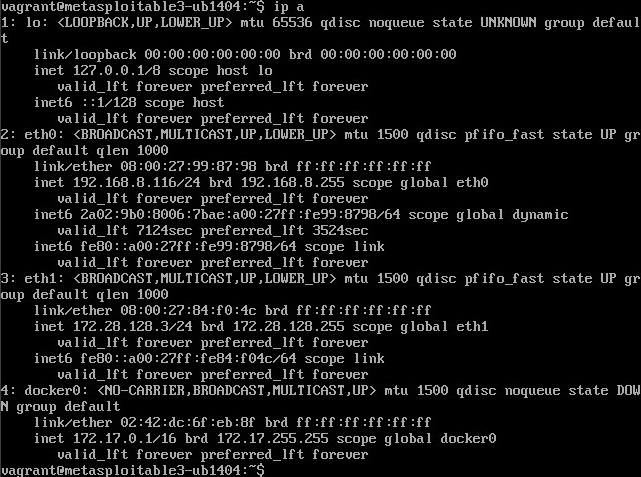
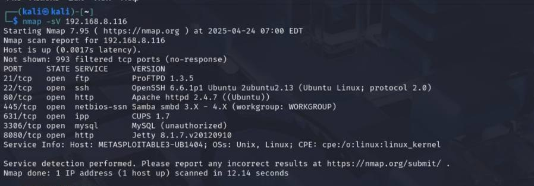
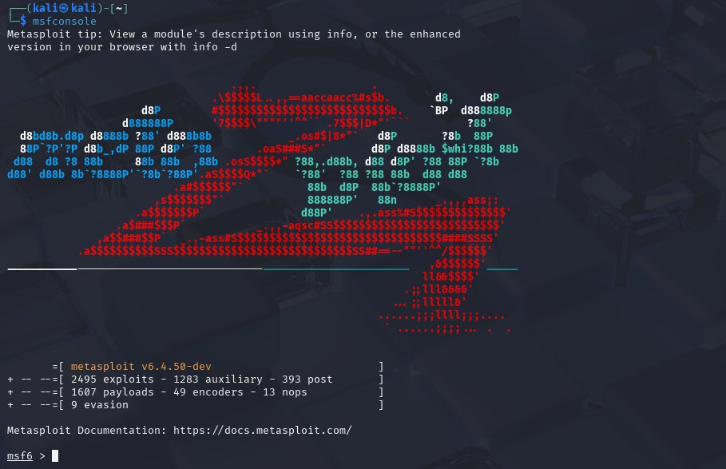
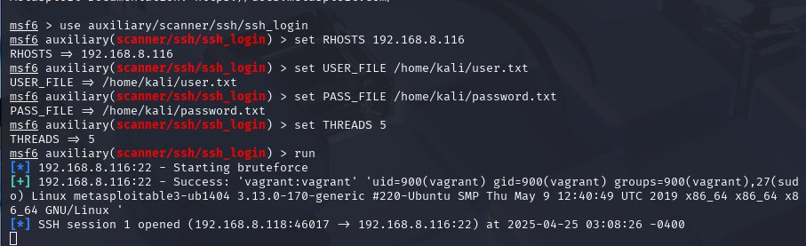
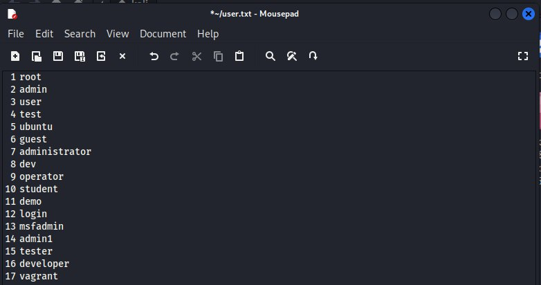
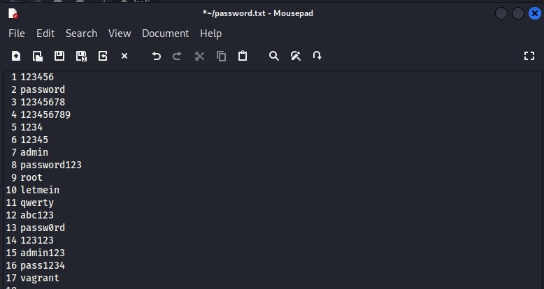
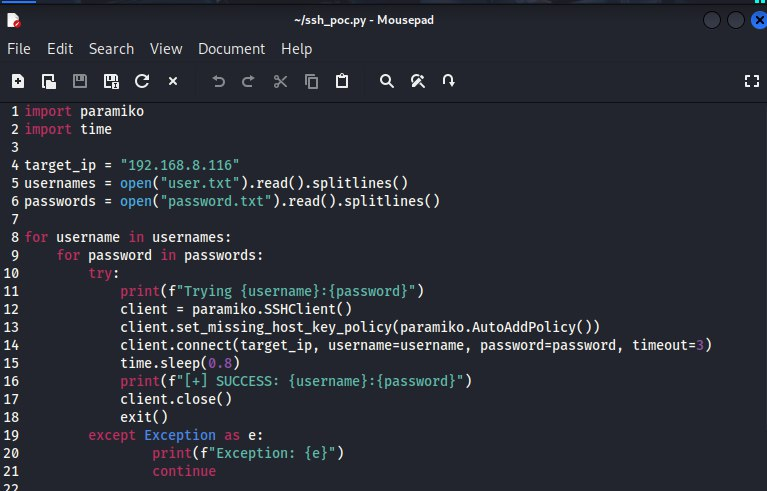
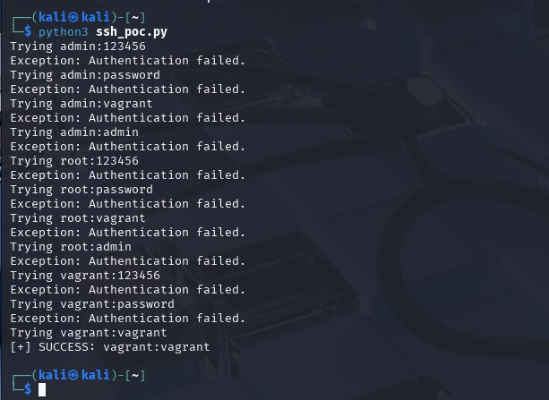

# 🛠️ Phase 1: Attack Setup and Execution

## 🔧 Environment Setup

- **Victim Machine:** Metasploitable3 (Ubuntu 14.04)
- **Attacker Machine:** Kali Linux (latest version)
- **Network Configuration:** Bridged Adapter (to allow both machines to communicate on the same local network)

### 📍 Victim IP Address


### 🔍 Nmap Scan Results
To verify open ports, we ran:
```bash
nmap -sV 192.168.8.116
```

Result showed that **port 22 (SSH)** was open:


---

## 🎯 Objective

To successfully brute-force SSH login on the victim machine using:
1. **Metasploit Framework** (with `ssh_login` auxiliary module)
2. A **custom Python script** leveraging the `paramiko` SSH library

---

## 📂 Tools & Files Used

| Tool/Script | Description |
|-------------|-------------|
| `Metasploit` | Used the `auxiliary/scanner/ssh/ssh_login` module |
| `ssh_poc.py` | Custom script to try user/pass combos using Paramiko |
| `user.txt`   | Common usernames |
| `password.txt` | Common/weak passwords |

> All scripts and wordlists are located in the `/Script/` and `/Wordlists/` folders.

---

## 💥 Attack Execution

### 🔹 Metasploit Attack

1. Started `msfconsole`
2. Used the `ssh_login` scanner module
3. Loaded user and password wordlists
4. Ran the brute-force attack

#### 🔧 Configuration:
```bash
use auxiliary/scanner/ssh/ssh_login
set RHOSTS 192.168.8.116
set USER_FILE /home/kali/user.txt
set PASS_FILE /home/kali/password.txt
run
```

#### 📸 Screenshots:
- Metasploit startup:  
  

- Module configuration:  
  

- Successful login:  
  

---

### 🔹 Custom Script Attack (Python + Paramiko)

We developed `ssh_poc.py` that:
- Reads usernames and passwords from `.txt` files
- Tries all combinations against the target IP
- Detects successful login

#### 💡 Important Code Segment:
```python
client.connect(target_ip, username=username, password=password, timeout=3)
```

#### 📸 Screenshots:
- User list:  
  

- Password list:  
  

- Script source code:  
  

- Script output (success with `vagrant:vagrant`):  
  

---

## ✅ Outcome

- **Successful login:**  
  Both Metasploit and the custom script identified `vagrant:vagrant` as working credentials.
- Full access to the target machine was achieved through SSH.

---

## ⚠️ Challenges Faced

| Issue | Solution |
|-------|----------|
| SSH connections failed initially | Verified IP and port accessibility via Nmap |
| Metasploit timeouts | Reduced thread count and simplified wordlists |
| Paramiko caused rapid failure | Added delay using `time.sleep(0.8)` to avoid server-side lockouts |
| Network isolation between VMs | Switched from NAT to Bridged Adapter in VirtualBox settings |

---

## 🔒 Disclaimer

> This attack was performed in a **controlled lab environment** for educational purposes only.  
> Never attempt unauthorized access to systems in real environments.

---

✅ *Phase 1 complete. Proceeding to SIEM log collection in Phase 2.*
