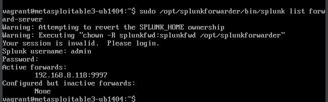
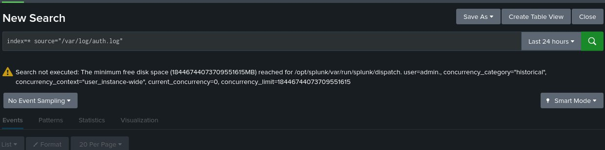
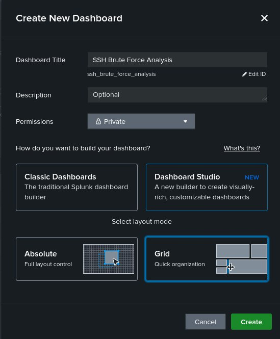
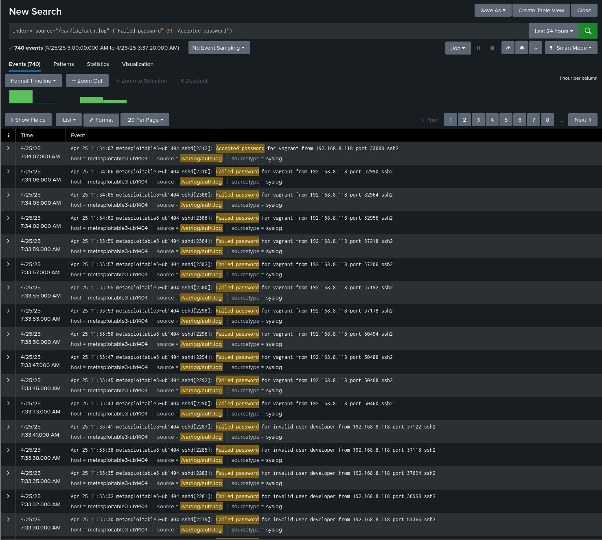
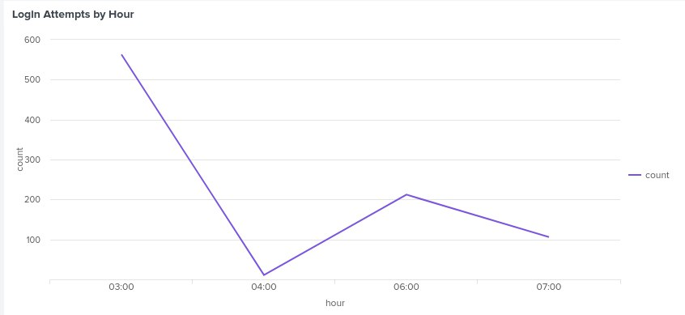
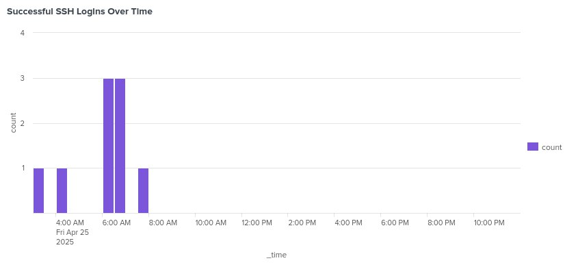
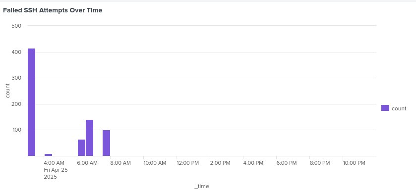

# 📊 Phase 2: SIEM Log Analysis with Splunk

## 🎯 Objective

The goal of this phase is to collect, index, and visualize SSH attack logs using **Splunk** as our SIEM platform. We monitored authentication attempts on the victim machine and generated meaningful insights on brute-force behavior.

---

## 🛠️ Setup Details

### ✅ Splunk Forwarder Configuration

We used the Universal Forwarder on the victim (Metasploitable3) to send logs to the Splunk server:

```bash
sudo /opt/splunkforwarder/bin/splunk list forward-server
```

This confirmed active forwarding:
<p align="center">
  <br>
  <em>Figure: Splunk forwarder successfully pointing to Splunk server</em>
</p>

---

## 🔍 Log Source

We monitored:
```bash
/var/log/auth.log
```

### ⚠️ Splunk Search Error
An error was triggered due to disk space limits:
<p align="center">
  <br>
  <em>Figure: Splunk unable to execute search due to disk usage exceeding limit</em>
</p>

#### 🛠️ Issue
Splunk displayed a warning due to hitting the maximum limit for dispatch space:
```
Search not executed: The minimum free disk space (...) reached for /opt/splunk/var/run/splunk/dispatch
```

#### ✅ Solution
To resolve this:
1. We **cleared old search jobs** from Splunk:
   ```bash
   sudo rm -rf /opt/splunk/var/run/splunk/dispatch/*
   ```

2. Then we **restarted Splunk** to reset its dispatch space:
   ```bash
   sudo /opt/splunk/bin/splunk restart
   ```

3. After restarting, Splunk successfully executed the search and resumed indexing logs.

> *If disk space is low, you can also increase the VM disk size or move the `dispatch` directory to a larger partition.*

---

## 📊 Dashboard Creation

We used **Dashboard Studio** and selected the **Grid** layout for organizing our visualizations:
<p align="center">
  <br>
  <em>Figure: Creating the "SSH Brute Force Analysis" dashboard</em>
</p>

---

## 📈 Log Search Output

We searched failed and successful SSH login attempts using:
```spl
index=* source="/var/log/auth.log" ("Failed password" OR "Accepted password")
```

<p align="center">
  <br>
  <em>Figure: Raw events filtered from the forwarded log</em>
</p>

---

## 📉 SIEM Dashboard Visualization

### 🧩 Full Dashboard View
<p align="center">
  <br>
  <em>Figure: SSH Brute Force Analysis dashboard</em>
</p>

### 📌 Breakdown Charts

#### 🔸 Login Outcome (Pie Chart)
<p align="center">
  <br>
  <em>Figure: 99% of login attempts failed</em>
</p>

#### 🔸 Login Attempts by Hour
<p align="center">
  
</p>

#### 🔸 Most Attacked Usernames
<p align="center">
  
</p>

#### 🔸 Successful SSH Logins Over Time
<p align="center">
  
</p>

#### 🔸 Failed SSH Attempts Over Time
<p align="center">
  
</p>

---

## ✅ Observations & Insights

- Most attacks occurred between **2:00 AM and 7:00 AM**
- Username `vagrant` was most targeted — eventually succeeded
- Over 95% of all login attempts **failed**
- Peak login activity observed around **3:00 AM**
- Attack patterns show brute-force behavior from a single IP

---

## 📌 Conclusion

This phase confirms that the system was successfully logging and forwarding security events. Splunk provided clear, actionable visualizations that will guide our defensive strategy in Phase 3.

> *All actions were performed in a sandboxed lab environment.*
