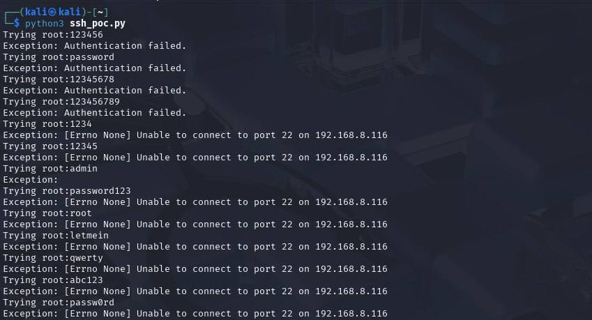

# 🛡️ Phase 3: Defensive Strategy Proposal

## 🎯 Objective

After identifying brute-force SSH attacks in Phase 2, this phase focuses on implementing and validating a **defensive mechanism**. We chose to deploy `fail2ban` to automatically detect repeated failed login attempts and ban malicious IPs.

---

## 🛠️ Defense Mechanism: `fail2ban`

### 🔹 Installation

We installed `fail2ban` manually on the Metasploitable3 VM using a `.deb` package:

```bash
sudo dpkg -i fail2ban_0.11.1-1_all.deb
```

<p align="center">
  <br>
  <em>Figure: Installing fail2ban on the victim machine</em>
</p>

---

### 🔹 Configuration

We modified `/etc/fail2ban/jail.local` to monitor SSH login attempts via `/var/log/auth.log`. Configuration settings included:

- `maxretry=4`
- `findtime=600` seconds
- `bantime=1800` seconds

<p align="center">
  <br>
  <em>Figure: fail2ban jail configuration targeting SSH login attempts</em>
</p>

---

### 🔍 Initial Status

Before triggering an attack, we verified that no IPs were currently banned:

<p align="center">
  <br>
  <em>Figure: Initial status of fail2ban — no IPs banned</em>
</p>

---

## 💥 Triggering and Observing the Defense

After running the brute-force script again, `fail2ban` detected the failed attempts and banned the attacker's IP:

<p align="center">
  <br>
  <em>Figure: Attacker IP 192.168.8.118 successfully banned</em>
</p>

---

## 🔎 Log Monitoring Results

### 📉 Splunk Search After Defense

After the ban was enforced, we checked `/var/log/auth.log` and visualized in Splunk. The number of login attempts significantly dropped:

<p align="center">
  <br>
  <em>Figure: Splunk search result shows limited activity after ban</em>
</p>

---

### 📊 Splunk Dashboard Comparison

<p align="center">
  <br>
  <em>Figure: Post-defense dashboard showing reduced SSH attempts</em>
</p>

---

### 🧪 Script Fails to Connect

The custom brute-force script failed to connect after the ban was applied:

<p align="center">
  <br>
  <em>Figure: Connection refused after fail2ban blocks the attacker's IP</em>
</p>

---

## ✅ Outcome

- `fail2ban` effectively blocked brute-force login attempts.
- The attacker's IP was logged, banned, and prevented from accessing SSH.
- Splunk confirmed the drop in activity after defense activation.

---

## 📌 Conclusion

This phase demonstrates how a simple host-based IDS/IPS like `fail2ban` can mitigate brute-force SSH attacks in real-time. The result is a hardened system that automatically responds to suspicious behavior without manual intervention.

> ✅ *Project goal accomplished: Detect ➜ Analyze ➜ Defend.*

